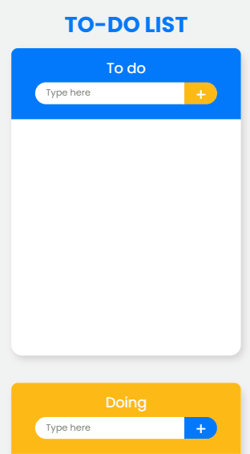
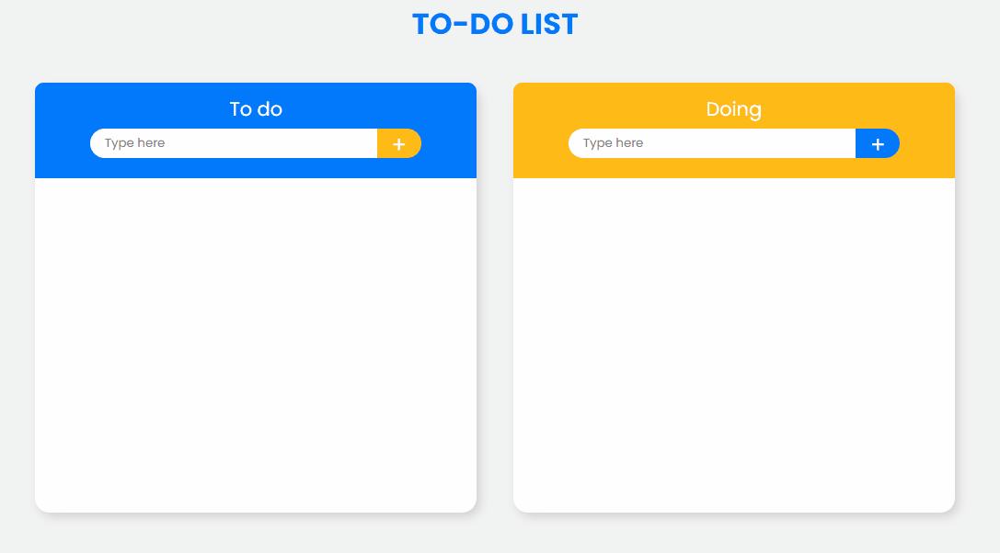

# To-do List

 To-do List is a generic task list. It can adds actions in two different areas that they will store in the browser, this means that if you update or close the page, they will back after open again.

  <a href="#features">Features</a> ●
  <a href="#preview">Preview</a> ● 
  <a href="#technologies">Technologies</a>

<h4 align="center"> ⚠️ This project can be changed ⚠️</h4>

<h2 id="features">✅ Features</h2>

- [x] Add tasks
- [x] Remove tasks individually
- [ ] Clear all tasks

<h2 id="preview">👁️ Preview</h2>

- GitHub Pages: https://victoroliverc.github.io/ToDo-List/

<h1 align="center">
  
  
</h1>

<h2 id="technologies">💻 Technologies used</h2>

- HTML5
- CS3
- JavaScript
